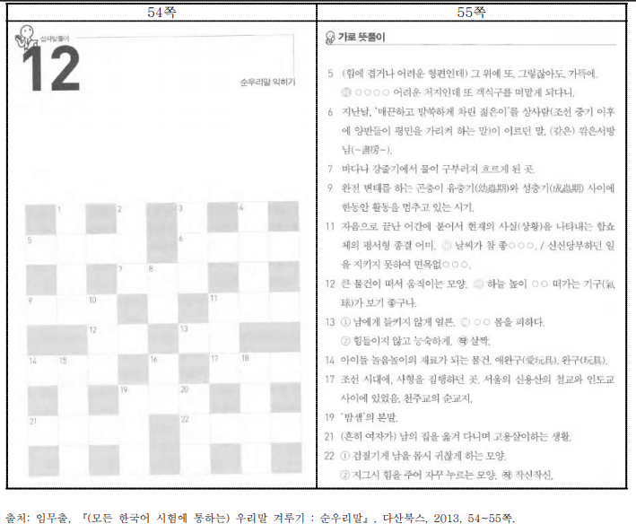

# 형식: 그림, 사진, 그래프, 지도

1. 제목 하나에 다른 유형의 시각자료가 나올 경우에는 \[시각자료], \[시각자료 끝]을
   &#x20;밝히고 각각의 시각자료 유형을 밝힌다.


2. 하나의 제목에 2개 이상의 같은 유형의 시각자료가 나올 경우에는 그림 확보 방
   법에 따라 다음과 같이 제작한다.


3. 셀의 자료에 그림과 텍스트가 혼용된 경우에는 표현할 수 있는 텍스트만 입력하
   고 그림으로 삽입한다.


4. 문제를 풀기 위한 지도의 경우에는 범례와 함께 문제를 풀기 위해 필요한 부분만
   &#x20;설명한다.


5. 그림에 대한 설명이 원본에 있고, 추가로 설명할 경우에는 원본의 설명 아래 부분에
   &#x20;\[그림 설명]을 밝히고 제작한다.


6. 십자말풀이의 경우에는 십자말풀이는 그림으로 삽입한 후 정답의 글자수를 표현해준다.

<details>

<summary>예시</summary>

> 원본
>
> 


```
@@p54
십자말풀이 12 순우리말 익히기
[그림]
@@i

[그림 끝]
@@p55
* 제작자 주: 뜻풀이에 정답의 글자수가 “○”로 기재되지 않은 경우, 글자 수를 알 수 있도록 글자수만큼 “□”로 입력하였음.
<가로 뜻풀이>
5 (힘에 겹거나 어려운 형편인데) 그 위에 또. 그렇잖아도. 가뜩에. (예) ○○○○ 어려운 처지인데
 또 객식구를 떠맡게 되다니.
6 지난날, ‘매끈하고 말쑥하게 차린 젊은이’를 상사람(조선 중기 이후에 양반들이 평민을 가리켜
 하는 말)이 이르던 말. (같은) 깎은서방님(書房). □□□□
7 바다나 강줄기에서 물이 구부러져 흐르게 된 곳. □□□
9 완전 변태를 하는 곤충이 유충기(幼蟲期)와 성충기(成蟲期) 사이에 한동안 활동을 멈추고 있는
시기. □□□
11 자음으로 끝난 어간에 붙어서 현재의 사실(상황)을 나타내는 합쇼체의 평서형 종결 어미. (예)
 날씨가 참 좋○○○. / 신신당부하던 일을 지키지 못하여 면목없○○○.
12 큰 물건이 떠서 움직이는 모양. (예) 하늘 높이 ○○ 떠가는 기구(氣球)가 보기 좋구나.
13 ① 남에게 들키지 않게 얼른. (예) ○○ 몸을 피하다.
② 힘들이지 않고 능숙하게. (작) 살짝. 14 아이들 놀음놀이의 재료가 되는 물건. 애완구(愛玩具). 완구(玩具). □□□
17 조선 시대에, 사형을 집행하던 곳. 서울의 신용산의 철교와 인도교 사이에 있었음. 천주교의
 순교지. □□□
19 ‘밤샘’의 본말. □□□
21 (흔히 여자가) 남의 집을 옮겨 다니며 고용살이하는 생활. □□□□
22 ① 검질기게 남을 몹시 귀찮게 하는 모양.
② 지그시 힘을 주어 자꾸 누르는 모양. (작) 작신작신. □□□□
```


</details>


7. 약도의 경우에는 상하좌우와 대칭을 고려하여 설명한다.

