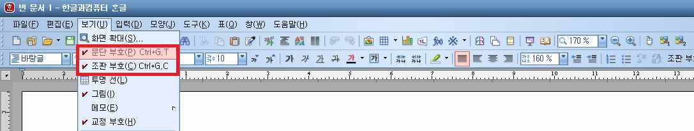

# 한컴오피스 한글

① 한글과 컴퓨터 프로그램 문서 편집형식을 따른다.

1. 문단은 들여쓰기 없이 모두 왼쪽 정렬한다.
2. 편집용지는 A4를 기준으로 한다.
3. 여백은 왼쪽과 오른쪽 각각 30, 위쪽 20, 15, 아래쪽 15, 15로 설정한다.
4. 문단모양은 여백 없음으로 설정한다.
5. 줄 간격은 160%로 한다.
6. 글자크기는 11 포인트로 설정하고 글자체는 바탕으로 한다.

② 본문 전체를 동일한 글자크기, 글자체, 색상으로 지정한다.


※ 글자크기, 글자체 또는 색상이 다를 경우 데이지 파일로 변환하는 과정에 새
로운 문단으로 인식될 수 있음을 유의한다.


③ 조판부호 항목을 선택하여 띄어쓰기를 정확하게 한다

<figure><figcaption>
[예] 한컴 문서 편집창 화면
</figcaption></figure>

